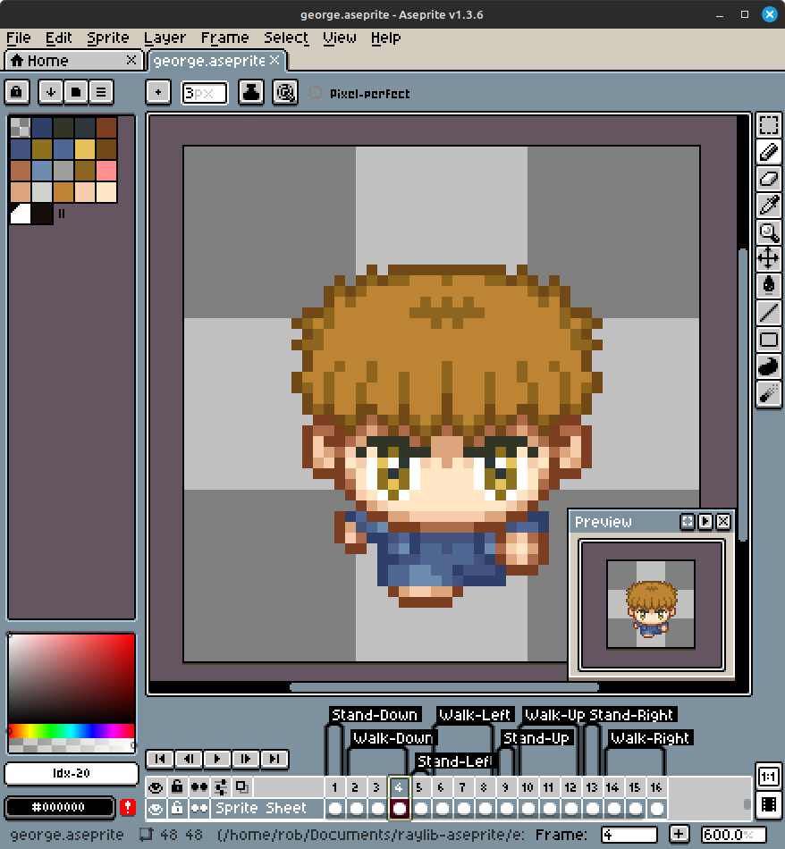
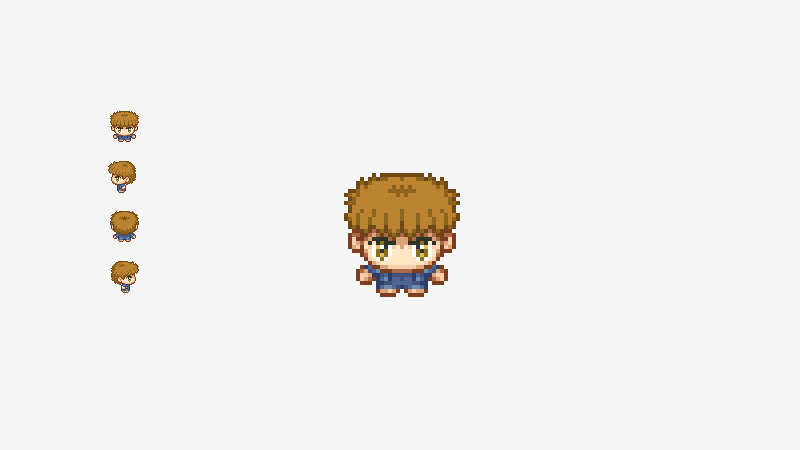

# raylib-aseprite

Load [Aseprite](https://www.aseprite.org) `.aseprite` and `.ase` files for animated sprites in [raylib](https://www.raylib.com).




## Features

- Load [Aseprite](https://www.aseprite.org/) files directly for use in raylib
- Draw individual frames
- Load and draw [Aseprite tags](https://www.aseprite.org/docs/tags/) as sprite animations
- Support for Forwards, Backwards, and Ping-Pong animations
- Adjust tag animation speed by using `tag.speed`
- Pause tag animations by using `tag.pause`
- Toggle whether animations will continue when they finish with `tag.loop`
- Load [Aseprite slice](https://www.aseprite.org/docs/slices/) rectangles for collisions and bounds

## Usage

This is a header-only library. To use it, define `RAYLIB_ASEPRITE_IMPLEMENTATION` in one .c source file before including [*raylib-aseprite.h*](include). You will also have to link the raylib dependency.

### Example

The below is a basic example, see the [examples](examples) folder for more.

``` c
#include "raylib.h"

#define RAYLIB_ASEPRITE_IMPLEMENTATION
#include "raylib-aseprite.h"

int main() {
    InitWindow(640, 480, "Aseprite Example");

    // Load the George Aseprite file.
    Aseprite george = LoadAseprite("resources/george.aseprite");

    // Load the Walk Down tag.
    AsepriteTag walkdown = LoadAsepriteTag(george, "Walk-Down");
    walkdown.speed = 2; // Double the animation speed.

    while(!WindowShouldClose()) {
        // Update the animation frame.
        UpdateAsperiteTag(&walkdown);

        BeginDrawing();
        {
            ClearBackground(RAYWHITE);

            // Draw the first frame from the George sprite.
            DrawAseprite(george, 0, 100, 100, WHITE);

            // Draw the Walk Down animation.
            DrawAsepriteTag(walkdown, 200, 100, WHITE);
        }
        EndDrawing();
    }

    // Clean up the George aseprite.
    UnloadAseprite(george);

    CloseWindow();
    return 0;
}
```

See the [examples directory](examples) for more demonstrations of how to use *raylib-aseprite*.

### API

``` c
// Aseprite functions
Aseprite LoadAseprite(const char* fileName);                        // Load an .aseprite file
Aseprite LoadAsepriteFromMemory(unsigned char* fileData, int size);  // Load an aseprite file from memory
bool IsAsepriteValid(Aseprite aseprite);                            // Check if the given Aseprite was loaded successfully
void UnloadAseprite(Aseprite aseprite);                             // Unloads the aseprite file
void TraceAseprite(Aseprite aseprite);                              // Display all information associated with the aseprite
Texture GetAsepriteTexture(Aseprite aseprite);                      // Retrieve the raylib texture associated with the aseprite
int GetAsepriteWidth(Aseprite aseprite);                            // Get the width of the sprite
int GetAsepriteHeight(Aseprite aseprite);                           // Get the height of the sprite
void DrawAseprite(Aseprite aseprite, int frame, int posX, int posY, Color tint);
void DrawAsepriteV(Aseprite aseprite, int frame, Vector2 position, Color tint);
void DrawAsepriteEx(Aseprite aseprite, int frame, Vector2 position, float rotation, float scale, Color tint);
void DrawAsepritePro(Aseprite aseprite, int frame, Rectangle dest, Vector2 origin, float rotation, Color tint);

// Aseprite Tag functions
AsepriteTag LoadAsepriteTag(Aseprite aseprite, const char* name);   // Load an Aseprite tag animation sequence
AsepriteTag LoadAsepriteTagFromIndex(Aseprite aseprite, int index); // Load an Aseprite tag animation sequence from its index
int GetAsepriteTagCount(Aseprite aseprite);                         // Get the total amount of available tags
bool IsAsepriteTagValid(AsepriteTag tag);                           // Check if the given Aseprite tag was loaded successfully
void UpdateAsepriteTag(AsepriteTag* tag);                           // Update the tag animation frame
AsepriteTag GenAsepriteTagDefault();                                // Generate an empty Tag with sane defaults
void DrawAsepriteTag(AsepriteTag tag, int posX, int posY, Color tint);
void DrawAsepriteTagV(AsepriteTag tag, Vector2 position, Color tint);
void DrawAsepriteTagEx(AsepriteTag tag, Vector2 position, float rotation, float scale, Color tint);
void DrawAsepriteTagPro(AsepriteTag tag, Rectangle dest, Vector2 origin, float rotation, Color tint);

// Aseprite Slice functions
AsepriteSlice LoadAsepriteSlice(Aseprite aseprite, const char* name);   // Load a slice from an Aseprite based on its name.
AsepriteSlice LoadAsperiteSliceFromIndex(Aseprite aseprite, int index); // Load a slice from an Aseprite based on its index.
int GetAsepriteSliceCount(Aseprite aseprite);                       // Get the amount of slices that are defined in the Aseprite.
bool IsAsepriteSliceValid(AsepriteSlice slice);                     // Return whether or not the given slice was found.
AsepriteSlice GenAsepriteSliceDefault();                            // Generate empty Aseprite slice data.
```

## Development

To build the example locally, and run tests, use [cmake](https://cmake.org/).

``` bash
git submodule update --init
mkdir build
cd build
cmake ..
make
cd examples
./raylib-aseprite-example
```

This uses [cute_aseprite.h](https://github.com/RandyGaul/cute_headers/blob/master/cute_aseprite.h) to handle loading the aseprite file. Thank you to [Randy Gaul's cute_headers](https://github.com/RandyGaul/cute_headers) for making this all possible.

## License

*raylib-aseprite* is licensed under an unmodified zlib/libpng license, which is an OSI-certified, BSD-like license that allows static linking with closed source software. Check [LICENSE](LICENSE) for further details.
