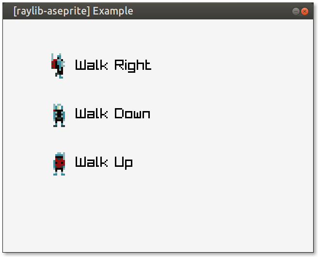

# raylib-aseprite

Load [Aseprite](https://aseprite.org) `.aseprite` files to use animated sprites in [raylib](https://raylib.com).



## Usage

This is a header-only library. To use it, define `RAYLIB_ASEPRITE_IMPLEMENTATION` in one .c source file before including *raylib-aseprite.h*. You will also have to link the raylib dependency.

### Example

``` c
#include "raylib.h"

#define RAYLIB_ASEPRITE_IMPLEMENTATION
#include "raylib-aseprite.h"

int main() {
    InitWindow(640, 480, "Aseprite Example");

    // Load the Aseprite file.
    ase_t* ase = LoadAseprite("resources/backpacker.aseprite");

    while(!WindowShouldClose()) {
        BeginDrawing();
        ClearBackground(RAYWHITE);

        // Draw the 0th frame from the aseprite.
        DrawAseprite(ase, 0, 100, 100, WHITE);

        EndDrawing();
    }

    UnloadAseprite(ase);
    CloseWindow();
    return 0;
}
```

### Cheatsheet

``` c
ase_t* LoadAseprite(const char* fileName);
ase_t* LoadAsepriteFromMemory(unsigned char* fileData, unsigned int size);
Texture GetAsepriteTexture(ase_t* ase);
void UnloadAseprite(ase_t* ase);
void TraceAseprite(ase_t* ase);
void DrawAseprite(ase_t* ase, int frame, int posX, int posY, Color tint);
void DrawAsepriteV(ase_t* ase, int frame, Vector2 position, Color tint);
void DrawAsepriteEx(ase_t* ase, int frame, Vector2 position, float rotation, float scale, Color tint);
void DrawAsepritePro(ase_t* ase, int frame, Rectangle dest, Vector2 origin, float rotation, Color tint);
```

## Development

To build the example locally, and run tests, use [cmake](https://cmake.org/).

``` bash
git submodule update --init
mkdir build
cd build
cmake ..
make
cd examples
./raylib-aseprite-example
```

This uses [cute_asesprite.h](https://github.com/RandyGaul/cute_headers/blob/master/cute_aseprite.h) to handle loading the aseprite file. Thank you to [Randy Gaul's cute_headers](https://github.com/RandyGaul/cute_headers) for making this all possible.

## License

raylib-aseprite is licensed under an unmodified zlib/libpng license, which is an OSI-certified, BSD-like license that allows static linking with closed source software. Check [LICENSE](LICENSE) for further details.
